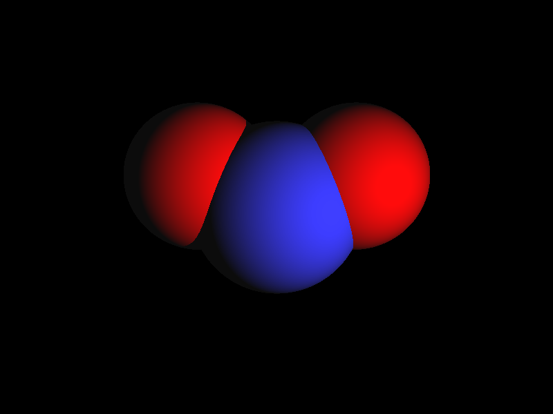
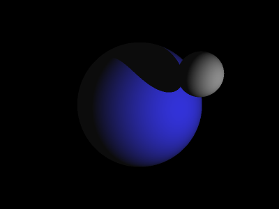

# hello-cg

My tries in Computer Graphics

Implemented for now:
- [x] Kinda Geometry and Material system
- [x] Scenes
- [x] Raytracing image renderer
- [x] Postprocessing classes
  - [x] Simple antialiasing (it works really sad)
  - [x] Sliding average filter
  - [ ] Filter with configurable weights

## Todo
- speculars, emissive, anisatropic shading
- textures (sometime)
- CUBES and meshes (sometime)
- transparency with refraction
- reflections
- skybox
- B-tree for efficient scene traversing
- look up some modern denoising techniques 

## Sample output
- No postprocessing

  
- With Simple AA:

  
- With sliding average 3x3 filter:

  

Migrated from https://github.com/mkrooted256/undergrad-work/tree/term6/6-graphics/raytracing
